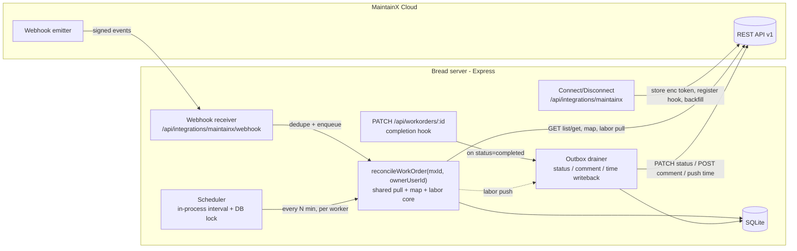
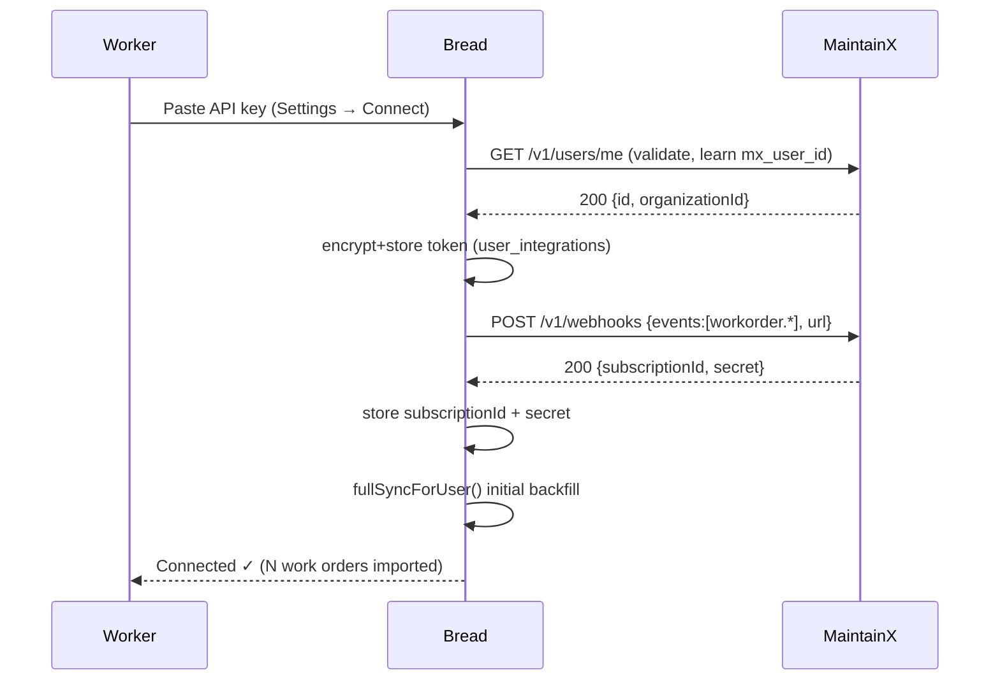

# MaintainX ↔ Bread Work-Order Sync — Integration Design

**Status:** Draft for review · **Version:** 0.1 · **Date:** 2026-06-25
**Author role:** Solutions architecture / senior engineering / QA / product
**App baseline:** Bread v0.66 (OTG Field Cost & Operations) — Node + Express + better-sqlite3

---

## 0. TL;DR

We are extending Bread's existing **single-ticket, on-demand** MaintainX pull (`fetchFromSource` → "paste a URL, prefill a form") into a **continuous, bidirectional work-order sync**:

1. **Pull** — every work order *assigned to a worker in MaintainX* (status `open`, `in_progress`, or `completed`) is mirrored into Bread for that worker.
2. **Status + comment writeback** — when a worker completes a WO in Bread, Bread sets the MaintainX WO to complete and appends a field comment on the linked MaintainX work order.
3. **Labor-time reconciliation** — when a WO is complete in *both* systems: if the worker logged labor time in Bread, Bread's time is the source of truth and is **pushed up** to MaintainX; otherwise Bread **pulls** MaintainX's "time taken" (prefer manually-logged Time & Cost entries, else the auto-computed In-Progress duration) and records it as the WO's labor time.
4. **Coverage** — the sync walks *all* of a worker's MaintainX WOs and updates labor time whenever it exists in MaintainX, whether the WO is in progress or completed.

**Confirmed product/architecture decisions (this round):**

| Decision | Choice |
|---|---|
| Sync trigger | **Webhooks + safety-net polling** (real-time events, scheduled full reconcile as backstop) |
| Worker identity | **Per-worker MaintainX login** (each worker connects their own MaintainX credentials; Bread pulls only that worker's assignments) |
| Labor source on import | **Prefer logged Time & Cost entries, else In-Progress duration** |
| Deliverable | This Markdown design doc, committed to the repo |

### Implementation status (this iteration)

**Built and tested (pull-first slice):**

- Per-worker connect with an **encrypted** token (`lib/maintainx/crypto.js`, AES-256-GCM) — `routes/integrations.js`: connect / status / disconnect.
- **On-demand pull** of a worker's assigned work orders (`lib/maintainx/{client,map,sync}.js`) — `POST /api/integrations/maintainx/sync-now` (all) and `POST /api/workorders/:id/sync-maintainx` (one). A **stub/demo mode** lets the flow run without a live token.
- **Labor import** (`lib/maintainx/labor.js`): prefer logged Time & Cost, else In-Progress duration → idempotent synthetic `work` time entry that feeds invoices; worker-entered time always wins.
- **On-demand sync UX** in the SPA (`public/app.js`): a "⟳ Sync MaintainX" button on the home work-order list and a per-WO "Sync" in the detail view, with a connect modal + demo option.
- Schema: `user_integrations`, `wo_sync_state`, `time_entries.source/external_ref` (+ idempotency index). Tests: `npm run test:maintainx` (6 groups / 33 assertions + HTTP smoke).

**Deferred to a later phase (per direction):** writeback to MaintainX — pushing Bread completion as MX status, the field comment, and pushing Bread-entered labor up to MX (the `app_wins` push branch). The data model (`integration_outbox`) and hooks for this are designed in §4–§6 but intentionally not wired yet. Automatic webhooks + scheduler are also still to come; sync is on-demand for now.

> **Feasibility caveat (read this first).** Three MaintainX API capabilities are **confirmed**; three are **assumed and must be locked down in a Phase 0 spike** before committing to build estimates. They are flagged throughout and summarized in §8. The architecture is deliberately designed so that if a capability is missing, a documented fallback applies without re-architecting.

---

## 1. Current state (what exists today)

### 1.1 Stack & runtime
- **Express** server (`server.js`), single process, one long-lived **better-sqlite3** handle (`db.open()` + `ensureSchema`).
- Routes are mounted under `/api` (`routes/*.js`). Bearer-token sessions resolve to `x-user-id` via `lib/auth.attachUserFromToken`.
- **No background scheduler exists.** Boot does `ensureSchema` + `purgeExpiredSessions` once, then `app.listen`. There is no cron, queue, or interval worker today — we must add one.
- Security headers, CSP, and `Cache-Control: no-store` on `/api/` are already in place.

### 1.2 Existing MaintainX integration
- `routes/workorders.js → fetchFromSource(source, ticketId, db)` performs a **live, single-WO** call:
  - `GET https://api.getmaintainx.com/v1/workorders/{id}` with `Authorization: Bearer <token>` (org header fallback for legacy plans).
  - Optional `GET /v1/locations/{id}` to resolve store name/address.
  - Unwraps the `{ "workOrder": {...} }` envelope; maps fields via `lib/maintainxExtract.js` (`parseCaperDescription`, `parseCartRangeFromTitle`, `countSubWOsFromProgress`, `classifyMxWorkType`).
- Triggered by `POST /api/workorders/parse-url` (paste a URL → prefilled create form). **Pull-only, on-demand, single ticket, no persisted sync state.**
- Credentials are **org-level and shared**, read via `settings.read(db, 'maintainx_api_key', 'MAINTAINX_API_KEY')` and `maintainx_organization_id` (default org `477835`). Managed in `routes/settings.js` (manager-gated, masked).

### 1.3 Relevant data model (as built)
```
work_orders(
  id PK, external_id UNIQUE,            -- canonical local key, e.g. "MX-RPR-97461873"
  source_system  IN('maintainx','freshdesk'),
  source_ticket_id,                     -- raw MX id, e.g. "97461873"
  title, work_type IN('deployment','retrofit','maintenance','repair'),
  store_id, store_name, store_address, cart_count, scheduled_date, description,
  status IN('open','in_progress','completed','cancelled') DEFAULT 'open',
  assigned_user_id -> users(id), created_at )

time_entries(
  id PK, user_id -> users, work_order_id -> work_orders,
  clock_in, clock_out, break_minutes DEFAULT 0,
  mode IN('work','drive') DEFAULT 'work',   -- 'drive' is NOT paid as labor
  notes, gps_*, invoice_id -> invoices, created_at )

users( id PK, name, email UNIQUE, role IN('technician','ops_manager','sr_manager','pm'),
       worker_type IN('contractor','fte'), hourly_rate DEFAULT 40.0, ... )

settings( key PK, value, updated_by, updated_at )   -- org-level integration creds, etc.
```
- **Labor hours** are computed in `db.js → sumHours(entries)` as `Σ((clock_out − clock_in) − break_minutes)`, over `mode='work'` entries (drive excluded). These roll into invoices (`time_entries.invoice_id`).
- **WO completion** today is just a field flip: `PATCH /api/workorders/:id` accepts `status` (validated against the enum at line ~114). There is **no dedicated "complete" endpoint** — this PATCH is our writeback hook.

### 1.4 Gap analysis (current → required)
| Capability | Today | Required |
|---|---|---|
| Auth | One shared org token | **Per-worker** MaintainX credentials (encrypted at rest) |
| Pull scope | One ticket by URL | **All WOs assigned to the worker**, paginated |
| Trigger | Manual paste | **Webhook events + scheduled poll** |
| Persistence of sync state | None | Per-WO sync metadata, idempotency keys |
| Direction | Pull only | **Bidirectional** (status, comment, labor) |
| Labor handling | App-only `time_entries` | **Reconcile** app ⇄ MaintainX with a source-of-truth rule |
| Scheduler / async | None | In-process scheduler + **outbox** for writebacks |

---

## 2. Requirements → acceptance criteria

| ID | Requirement (verbatim intent) | Acceptance criteria |
|---|---|---|
| **R1** | All WOs assigned to a worker in MaintainX integrate into Bread. | Given a worker has connected MaintainX, when sync runs, then every MX WO whose assignee is that worker (status `open`/`in_progress`/`completed`) exists in `work_orders` with `assigned_user_id = worker`, mapped fields populated, and re-running sync creates **no duplicates**. |
| **R2** | On Bread completion, sync status to MaintainX and update the linked WO's field comments. | When a worker sets a linked WO to `completed` in Bread, then within the writeback SLA the MaintainX WO status becomes complete **and** a comment is appended to that MX WO. Failure is retried and surfaced; the user's request is never blocked on MX latency. |
| **R3** | When a WO is complete in both systems, import MaintainX "time taken" as labor; if the worker logged labor in Bread, push Bread's time to MaintainX instead. | When a WO is `completed` in Bread **and** complete in MX: if Bread labor `> 0`, MX is updated to Bread's labor (app wins, push). Else Bread records labor from MX (prefer logged Time & Cost, else In-Progress duration, pull). The decision is **idempotent** and **audited**. |
| **R4** | The sync pulls all WOs and updates labor time if it exists in MaintainX; the MX WO may be in progress or completed. | A full sync run covers the worker's entire assigned set; whenever MX exposes time for a WO (in-progress or completed), Bread reflects it under the R3 rule. |

**Non-functional:** secrets encrypted at rest and never returned; webhook authenticity verified (HMAC); least privilege (a worker can only sync/writeback their own WOs); resilient to MX `429`/`5xx`; observable (audit + error surfacing); no regression to the existing `parse-url` flow or invoice math.

---

## 3. MaintainX API capability matrix

> Endpoints marked **Confirmed** are corroborated by MaintainX's docs/help center and/or already exercised by the app. Items marked **VERIFY (Phase 0)** are assumptions; each has a fallback.

| Need | Endpoint / mechanism | Status | Notes / fallback |
|---|---|---|---|
| List WOs (paginated) | `GET /v1/workorders` → cursor pagination (`nextCursor` → `?cursor=`) | **Confirmed** | Loop until `nextCursor` is null. |
| Expand assignees/asset | `?expand=assignees&expand=asset` | **Confirmed** | Lets us read assignee identity inline. |
| Filter by assignee + status | query params on the list endpoint | **VERIFY** | Param names unconfirmed (e.g. `assignedTo`/`assignees`, `statuses`). Fallback: list all, filter client-side by expanded `assignees[].id == worker.mxUserId`. |
| Get one WO | `GET /v1/workorders/{id}` | **Confirmed** | App already uses it (`fetchFromSource`). |
| Update WO | `PATCH /v1/workorders/{id}` | **Confirmed** | |
| Update WO **status** | `PATCH /v1/workorders/{id}/status` | **Confirmed** | Dedicated status endpoint. **VERIFY** the exact "complete" enum value (`DONE`/`COMPLETED`). |
| Resolve location | `GET /v1/locations/{id}` | **Confirmed** | App already uses it. |
| **Comment / field note** writeback | `POST /v1/workorders/{id}/...` (conversation/comment) | **VERIFY** | Exact path/payload unconfirmed. Fallbacks in priority order: (a) WO comment endpoint; (b) append to `description` via PATCH; (c) write a designated custom/extra field. |
| **Read** logged time / "time taken" | field on the WO response or a time sub-resource | **VERIFY** | Unconfirmed whether v1 exposes Time & Cost entries or a `timeSpent` field. Fallback if absent: derive In-Progress duration from `workorder.status_changed` webhook timestamps we record. |
| **Write** time entry (push Bread labor) | time sub-resource POST | **VERIFY** | If no write endpoint exists, fallback: post Bread labor as a **structured comment** + a custom field, and treat MX-side time as advisory. |
| Webhooks | `POST /v1/webhooks`, events `workorder.created/updated/status_changed/completed`; `x-maintainx-signature` HMAC-SHA256; list + delete supported | **Confirmed** | **VERIFY** whether subscriptions are token/org-scoped (drives dedupe with per-worker tokens). |
| Auth | `Authorization: Bearer <token>` (Settings → Integrations → API Keys) | **Confirmed** | **VERIFY** whether per-worker **OAuth** exists; if not, onboarding = each worker pastes a personal API key. |
| Identify the connected worker | `GET /v1/users/me` or `/v1/users` | **VERIFY** | Needed to learn `mxUserId` for assignee filtering. |

**Plan note:** MaintainX's Time Tracking module is an Enterprise-tier feature — confirm the org's plan exposes it both in-product and via API.

---

## 4. Recommended data model

Principle: **keep `work_orders` lean; isolate provider-specific sync metadata in side tables; make every synced artifact idempotent and auditable.**

### 4.1 New: `user_integrations` (per-worker MaintainX credentials)
```sql
CREATE TABLE IF NOT EXISTS user_integrations (
  id                    INTEGER PRIMARY KEY AUTOINCREMENT,
  user_id               INTEGER NOT NULL REFERENCES users(id),
  provider              TEXT    NOT NULL DEFAULT 'maintainx',
  mx_user_id            TEXT,                 -- assignee id used to filter the worker's WOs
  mx_org_id             TEXT,
  access_token_enc      TEXT    NOT NULL,     -- AES-256-GCM ciphertext; never returned to clients
  token_type            TEXT    DEFAULT 'api_key' CHECK (token_type IN ('api_key','oauth')),
  token_expires_at      TEXT,                 -- null for non-expiring API keys
  webhook_subscription_id TEXT,               -- so we can delete it on disconnect
  webhook_secret_enc    TEXT,                 -- HMAC signing secret for this subscription
  status                TEXT    DEFAULT 'active' CHECK (status IN ('active','needs_reauth','disabled')),
  last_sync_at          TEXT,
  last_error            TEXT,
  connected_at          TEXT    DEFAULT CURRENT_TIMESTAMP,
  UNIQUE(user_id, provider)
);
```

### 4.2 New: `wo_sync_state` (per-WO sync metadata + idempotency)
```sql
CREATE TABLE IF NOT EXISTS wo_sync_state (
  work_order_id     INTEGER REFERENCES work_orders(id),
  provider          TEXT    NOT NULL DEFAULT 'maintainx',
  mx_workorder_id   TEXT    NOT NULL,         -- raw MX id
  mx_sequential_id  INTEGER,                  -- human-facing WO number
  mx_status         TEXT,                     -- raw MX status string
  mx_updated_at     TEXT,                     -- MX-side last-modified (skip no-op pulls)
  content_hash      TEXT,                     -- hash of mapped fields; skip identical upserts
  last_pulled_at    TEXT,
  last_pushed_at    TEXT,
  labor_direction   TEXT CHECK (labor_direction IN ('push','pull','none')),
  labor_minutes     INTEGER,                  -- last reconciled labor value
  labor_synced_at   TEXT,
  PRIMARY KEY (provider, mx_workorder_id)
);
```

### 4.3 Changed: `time_entries` (provenance + idempotency for pulled labor)
```sql
ALTER TABLE time_entries ADD COLUMN source TEXT DEFAULT 'app'
  CHECK (source IN ('app','maintainx_sync'));
ALTER TABLE time_entries ADD COLUMN external_ref TEXT;   -- MX time-entry id (or 'mx-inprogress:<woId>')
-- partial-unique on (source, external_ref) so re-sync never double-inserts
CREATE UNIQUE INDEX IF NOT EXISTS ux_time_entries_extref
  ON time_entries(source, external_ref) WHERE external_ref IS NOT NULL;
```
Pulled MaintainX labor becomes a **synthetic `time_entry`** (`mode='work'`, `source='maintainx_sync'`). Rationale: it flows through the existing `sumHours`/invoice pipeline unchanged, is fully auditable, and is reversible. The unique index guarantees idempotency on re-runs.

### 4.4 New: `integration_outbox` (durable writeback queue)
```sql
CREATE TABLE IF NOT EXISTS integration_outbox (
  id              INTEGER PRIMARY KEY AUTOINCREMENT,
  user_id         INTEGER REFERENCES users(id),
  work_order_id   INTEGER REFERENCES work_orders(id),
  kind            TEXT NOT NULL CHECK (kind IN ('status','comment','time')),
  payload         TEXT NOT NULL,              -- JSON
  status          TEXT NOT NULL DEFAULT 'pending'
                    CHECK (status IN ('pending','done','failed','dead')),
  attempts        INTEGER DEFAULT 0,
  next_attempt_at TEXT,
  last_error      TEXT,
  created_at      TEXT DEFAULT CURRENT_TIMESTAMP
);
```

### 4.5 New: `integration_events` (inbound webhook log + dedupe)
```sql
CREATE TABLE IF NOT EXISTS integration_events (
  id              INTEGER PRIMARY KEY AUTOINCREMENT,
  provider        TEXT NOT NULL DEFAULT 'maintainx',
  delivery_id     TEXT,                       -- MX delivery/event id, for dedupe
  event_type      TEXT,                       -- workorder.completed, etc.
  mx_workorder_id TEXT,
  signature_ok    INTEGER,
  raw             TEXT,
  received_at     TEXT DEFAULT CURRENT_TIMESTAMP,
  processed_at    TEXT,
  UNIQUE(provider, delivery_id)
);
```

### 4.6 New settings keys (org-level defaults)
- `integ_maintainx_status_complete_value` — the MX status enum to send on completion (default to the value confirmed in Phase 0).
- `integ_maintainx_comment_template` — template for the field comment (supports tokens like `{labor_hours}`, `{invoice_link}`, `{worker_name}`).
- `integ_maintainx_poll_minutes` — safety-net poll cadence (default 20).

> We intentionally do **not** add provider columns to `work_orders`; `external_id`/`source_system`/`source_ticket_id`/`status`/`assigned_user_id` already exist and remain the join surface. Everything new lives in side tables.

---

## 5. Architecture

### 5.1 Components


### 5.2 New module layout
```
lib/maintainx/
  client.js        # thin HTTP client: auth header, pagination, retry/backoff, 429 handling
  auth.js          # AES-256-GCM encrypt/decrypt of per-worker tokens (key from env MX_TOKEN_ENC_KEY)
  map.js           # MX WO JSON -> work_orders row (wraps existing lib/maintainxExtract.js)
  sync.js          # reconcileWorkOrder(), fullSyncForUser(), pull loop, content-hash skip
  labor.js         # decideLabor(appLabor, mxTime) -> {direction, minutes}; idempotent apply
  webhook.js       # HMAC verify, event dedupe, event -> reconcile dispatch
  outbox.js        # enqueue + drain (status/comment/time), retry w/ exponential backoff + dead-letter
  scheduler.js     # interval runner + DB advisory lock (single-runner guarantee)
routes/integrations.js   # connect, disconnect, status, "sync now", webhook receiver
```
The existing `fetchFromSource` is refactored so its mapping logic is shared with `lib/maintainx/map.js` (no behavior change to `parse-url`).

### 5.3 Identity & onboarding (per-worker)
1. Worker opens **Settings → Connect MaintainX** and pastes a personal API key (or completes OAuth if Phase 0 confirms it).
2. Bread validates the token (`GET /v1/users/me` or a 1-item list), captures `mx_user_id` + `mx_org_id`, encrypts and stores the token in `user_integrations`.
3. Bread registers a webhook subscription for that token and stores the subscription id + signing secret.
4. Bread runs an **initial backfill** (`fullSyncForUser`) so the worker's assigned WOs appear immediately.

Assignee scoping: prefer the server-side filter (Phase 0 confirms the param); otherwise list-all + filter on expanded `assignees[].id == mx_user_id`. The connected worker becomes `work_orders.assigned_user_id`.

### 5.4 Trigger model — webhooks + safety-net poll
- **Webhooks (primary):** signed `workorder.*` events hit `/api/integrations/maintainx/webhook`. We verify the HMAC, dedupe by `delivery_id` (`integration_events`), respond `2xx` immediately, and dispatch `reconcileWorkOrder` asynchronously.
- **Poll (backstop):** `scheduler.js` runs every `integ_maintainx_poll_minutes` (default 20). For each `active` integration it pages the worker's WOs and reconciles. This covers dropped webhooks, downtime, and historical backfill. A **DB advisory-lock row** guarantees a single runner if the app ever scales to multiple machines (Fly). A manager-triggered **`POST /api/integrations/maintainx/sync-now`** runs the same path on demand.
- All three funnel through one **idempotent `reconcileWorkOrder(mxId, ownerUserId)`** so behavior is identical regardless of trigger.

### 5.5 Writeback — outbox pattern (app → MaintainX)
- The completion hook is the existing `PATCH /api/workorders/:id` when `status` transitions to `completed`. After the local commit, Bread **enqueues** outbox rows (`status`, `comment`, and—per §6—possibly `time`); it does **not** call MaintainX inline.
- `outbox.js` drains pending rows: `PATCH /workorders/{id}/status` → complete; `POST` the field comment; push time when applicable. Retries use exponential backoff; exhausted rows go to `dead` and surface in the manager view. This keeps the worker's request fast and makes MaintainX outages non-blocking.

### 5.6 Reliability, security, observability
- **Encryption:** tokens & webhook secrets via AES-256-GCM (`MX_TOKEN_ENC_KEY` from env/secrets). Never returned to clients; reuse the masking pattern from `routes/settings.js`.
- **Webhook auth:** constant-time HMAC-SHA256 compare on `x-maintainx-signature`; reject unsigned/invalid; size-limit the body; the route is exempt from the JSON body limit only as needed for raw-body signature checking.
- **AuthZ:** a worker can only connect/disconnect their own integration and only writeback their own WOs; manager roles (`ops_manager`/`sr_manager`/`pm`) can view sync health and force a sync.
- **Rate limits:** central client honors `429`/`Retry-After` with jittered backoff; the poller paginates politely.
- **Audit:** `logAudit` on connect/disconnect, every push/pull, and—critically—each labor decision (direction + values), so finance can trace any synced hour.

---

## 6. Workflows

### 6.1 W1 — Connect MaintainX (per worker)

Failure: invalid token → 401 → show "couldn't connect"; webhook register failure → keep integration but mark `needs_reauth` for the hook and rely on poll.

### 6.2 W2 — Pull / reconcile a WO (webhook or poll)
```mermaid
sequenceDiagram
  participant T as Trigger (webhook/poll/sync-now)
  participant B as Bread reconcileWorkOrder
  participant M as MaintainX
  T->>B: mxWorkOrderId, ownerUserId
  B->>M: GET /v1/workorders/{id}?expand=assignees,asset
  M-->>B: WO JSON
  B->>B: verify assignee == worker; map fields (lib/maintainx/map.js)
  B->>B: content-hash vs wo_sync_state (skip if unchanged)
  B->>B: upsert work_orders by external_id (no dup); update wo_sync_state
  opt MX status == complete
    B->>B: run labor reconciliation (W4)
  end
  B-->>T: done (idempotent)
```
Mapping rules: `external_id` reuses the existing `MX-<TYP>-<ticket>` scheme; `status` maps MX→Bread enum (`open`/`in_progress`/`completed`/`cancelled`); store/cart/work_type via the existing extractors. Unmapped `work_type` follows the current "require manual pick" behavior — we never guess.

### 6.3 W3 — Bread completes a WO → status + comment writeback
```mermaid
sequenceDiagram
  participant U as Worker
  participant B as Bread
  participant O as Outbox drainer
  participant M as MaintainX
  U->>B: PATCH /api/workorders/:id {status:'completed'}
  B->>B: validate + commit locally
  B->>B: enqueue outbox(status), outbox(comment)
  B-->>U: 200 (fast; not blocked on MX)
  O->>M: PATCH /v1/workorders/{mxId}/status {complete}
  O->>M: POST comment (field note: labor summary + link)
  M-->>O: 200/err (retry on err; dead-letter if exhausted)
  O->>B: if MX now complete → trigger labor reconciliation (W4)
```
"Field comments" = a comment on the MaintainX WO conversation (fallback: description/custom field per §3). The comment body is rendered from `integ_maintainx_comment_template`.

### 6.4 W4 — Labor reconciliation (the core decision)
Runs only when the WO is **complete in both systems**.
```
appLabor   = sumHours(time_entries WHERE work_order_id=? AND mode='work')   # excludes 'drive'
mxLogged   = Σ MaintainX Time & Cost logged entries        # VERIFY availability
mxInProg   = MaintainX auto In-Progress duration            # from MX field or our status_changed timestamps
mxTime     = mxLogged  (if present and > 0)  else  mxInProg # "prefer logged, else In-Progress"

if appLabor > 0:                 # worker logged time in Bread → Bread wins
    direction = 'push'
    enqueue outbox(time, minutes = appLabor)      # update MaintainX to Bread's value
else:                            # no Bread labor → import from MaintainX
    direction = 'pull'
    upsert synthetic time_entry(mode='work', source='maintainx_sync',
                                external_ref = mx-entry-id or 'mx-inprogress:<woId>',
                                duration = mxTime)        # idempotent via unique index
record wo_sync_state(labor_direction, labor_minutes, labor_synced_at); logAudit(decision)
```
Properties:
- **Idempotent:** unique `(source, external_ref)` prevents duplicate pulled entries; `wo_sync_state` prevents redundant pushes (skip if `labor_minutes` unchanged).
- **Source-of-truth transition:** if a worker later adds Bread time after a pull, the next reconcile sees `appLabor > 0` and switches to **push** (Bread wins). The previously-pulled synthetic entry is superseded/curated (documented: pulled entries are replaced, not stacked).
- **Semantics flag:** MaintainX In-Progress duration is wall-clock between status changes and may include non-labor time; Bread labor excludes `drive`. Pulled MX time is recorded as `work` labor — call this out to finance. (Phase 0 decides whether to prefer logged entries precisely to avoid this.)

### 6.5 W5 — Disconnect
Delete the MX webhook subscription, purge the encrypted token, set integration `disabled`. **Retain** already-synced WOs and time entries (they're now Bread records); stop future pulls/pushes for that worker.

### 6.6 Edge cases & failure handling
| Scenario | Handling |
|---|---|
| Token revoked/expired (`401`) | Mark integration `needs_reauth`, stop calls, surface a reconnect prompt; poll skips it. |
| Duplicate webhook delivery | `integration_events` UNIQUE(`delivery_id`) dedupes; reconcile is idempotent anyway. |
| Webhook endpoint down | Poll backstop reconciles on next run; no data loss. |
| MX WO reassigned away from worker | Reconcile detects assignee change; stop owning it (configurable: keep historical or mark unassigned). |
| Same WO assigned to multiple workers | Owner = the connected worker(s); first-connected owns labor writeback; document multi-assignee policy. |
| `429`/`5xx` from MX | Central backoff; outbox retries; dead-letter after N attempts. |
| Concurrent edits (worker edits Bread while webhook arrives) | `content_hash` + `mx_updated_at` guards; last-writer per field with audit; labor follows the W4 rule deterministically. |
| Clock skew on In-Progress duration | Prefer logged entries; clamp negative/implausible durations (mirror existing time-entry future/duration caps). |
| Plan lacks Time Tracking API | Fallback to status-change-derived duration; if even that is unavailable, leave labor app-only and flag the WO. |

---

## 7. Architecture evaluation (trade-offs)

| Decision | Chosen | Alternatives & why not |
|---|---|---|
| Trigger | **Webhooks + poll** | Poll-only: simpler but laggy and wasteful at scale. Webhook-only: real-time but fragile (a dropped event = permanent drift). Hybrid gives real-time + self-healing. Cost: public signed endpoint, dedupe, a scheduler. |
| Identity | **Per-worker login** | Org-token + email map is closer to today and lower onboarding friction, but per-worker gives clean assignee scoping, least privilege, and removes brittle email matching. Cost: token lifecycle, encryption, more webhook subs + dedupe, per-worker onboarding. |
| Writeback | **Outbox (async)** | Synchronous writeback is simpler but couples the worker's request to MX uptime/latency and loses retries. Outbox adds a table + drainer but is far more robust. |
| Pulled labor storage | **Synthetic `time_entry` w/ provenance** | A `work_orders.actual_labor_minutes` column avoids a synthetic row but requires changing every invoice/labor calculation to prefer it. The synthetic entry rides the existing `sumHours`/invoice path with zero downstream math changes and is auditable/reversible. |
| Scheduler | **In-process interval + DB lock** | External cron (Fly scheduled machine / GitHub Action hitting `sync-now`) is more "correct" for multi-instance, but in-process keeps deploy simple now; the DB lock makes it safe and the design leaves a clean seam to externalize later. |
| Token storage | **Encrypted in app DB** | A secrets manager is ideal but heavier; AES-GCM with an env-provided key is a pragmatic, documented middle ground consistent with the app's current secret handling. |

---

## 8. Open questions & assumptions to close in Phase 0

1. **Comment writeback** — exact endpoint/payload for a WO comment (vs. description/custom-field fallback). *(Blocks R2.)*
2. **Time read** — does v1 expose logged Time & Cost entries and/or a `timeSpent`/In-Progress field on the WO? *(Shapes R3 pull.)*
3. **Time write** — is there an endpoint to push a labor/time entry? If not, push-as-comment fallback. *(Shapes R3 push.)*
4. **Status enum** — the precise value(s) for "complete" on `PATCH /workorders/{id}/status`.
5. **Assignee/status filters** — real query-param names on the list endpoint (else client-side filter).
6. **Auth model** — per-worker OAuth vs personal API keys (drives onboarding UX).
7. **Webhook scoping** — are subscriptions per-token or per-org? (drives dedupe with many connected workers).
8. **"Field comments" intent** — confirm this means the MX WO comment thread vs. a custom field literally named "comments".
9. **Plan tier** — confirm the org's MaintainX plan exposes Time Tracking via API.
10. **Drive vs. work** — confirm finance is OK treating pulled MX time as `work` labor (drive unrepresented).

---

## 9. Phased implementation plan

| Phase | Scope | Exit criteria |
|---|---|---|
| **0 — Spike** (1–2 days) | Hit MX with a real token: capture a sample WO JSON (does it carry time?), test comment POST, status PATCH, list filters, webhook register + delivery. | §8 items 1–8 answered; contract + fallbacks chosen; estimates firmed. |
| **1 — Connect + read-only pull** | `user_integrations`, encryption, `lib/maintainx/{client,auth,map}.js`, `routes/integrations.js`, manual **Sync now**. (R1) | A connected worker's assigned WOs appear in Bread; re-sync makes no duplicates. |
| **2 — Automatic sync** | Scheduler + DB lock, webhook receiver + dedupe, `wo_sync_state`, `reconcileWorkOrder`. | WOs update automatically via events and the poll backstop. |
| **3 — Status + comment writeback** | Completion hook → `integration_outbox` → drainer; comment template. (R2) | Completing in Bread reliably completes the MX WO and posts a comment, with retries. |
| **4 — Labor reconciliation** | `lib/maintainx/labor.js`, synthetic `time_entries`, push path, invoice verification. (R3, R4) | Both branches (push when app has time; pull otherwise) work, idempotent, audited; invoices reflect synced labor correctly. |
| **5 — Hardening** | Rate-limit/backoff, dead-letter UX, reauth flow, observability, full test suite. | QA plan (§10) green; no regression to `parse-url` or invoice math. |

---

## 10. QA / test plan

**Unit**
- `map.js` field mapping (reuse/extend `maintainxExtract` fixtures, incl. Caper description/title patterns).
- `labor.decideLabor` truth table: `appLabor>0` → push; `appLabor=0` & logged → pull logged; `appLabor=0` & only in-progress → pull in-progress; both zero → none.
- HMAC verify (valid/invalid/missing signature, constant-time).
- Token encrypt/decrypt round-trip; masked output never leaks plaintext.
- Idempotency: re-running pull does not duplicate `work_orders` (by `external_id`) or `time_entries` (by `source,external_ref`).

**Integration (mock MaintainX)**
- Full paginated pull (multi-page `nextCursor`).
- Webhook → reconcile; duplicate delivery dedupe; out-of-order events.
- Writeback drain: status + comment; `429`/`5xx` → retry → success; exhaustion → dead-letter.
- Reconcile both labor branches end-to-end.

**E2E / acceptance (mapped to R1–R4)**
- R1: connect → assigned WO visible; re-sync no dup.
- R2: complete in Bread → MX status complete + comment present.
- R3 push: log Bread time → complete both → MX time updated to Bread's value.
- R3 pull: no Bread time → complete both → Bread shows MX time (logged preferred, else in-progress).
- R4: full run covers entire assigned set; in-progress WO with MX time reflects it.

**Regression**
- `POST /api/workorders/parse-url` unchanged.
- Invoice math correct with `source='maintainx_sync'` entries.
- Techs still cannot see manager-only integration settings.

**Security review** — token-at-rest, webhook spoofing, cross-worker writeback authz, SSRF on webhook URL config, audit completeness.

---

## 11. Appendix — sequence summary

- **Pull** (event/poll/manual) → `reconcileWorkOrder` → map + upsert → if MX-complete, reconcile labor.
- **Push** (Bread completion) → outbox → MX status + comment → if both complete, reconcile labor.
- **Labor** → app wins (push) if Bread has logged work time; otherwise pull MX time (logged > in-progress).
- **Self-healing** → poll + idempotent reconcile recover any missed webhook with no duplicates.
